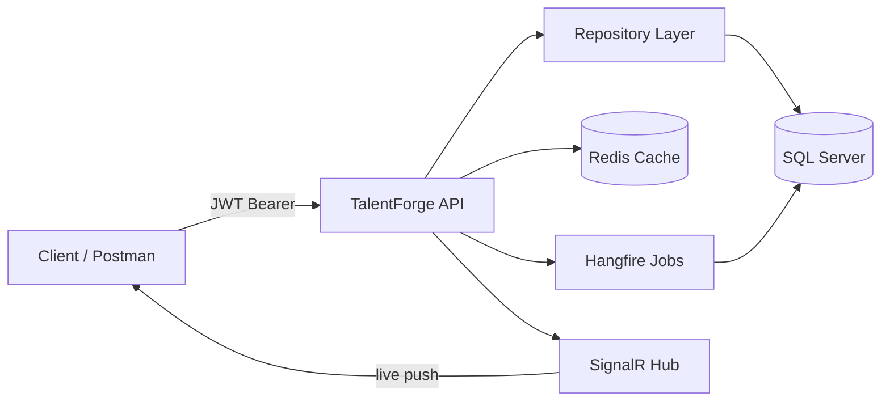

<div align="center">

# 🎯 TalentForge

**Job Portal & Applicant Tracking System — built in .NET / C#**

[](https://dotnet.microsoft.com/)
[](../../actions)
[](https://www.docker.com/)
[](https://railway.app)


*A production-shaped backend for job matching — built solo, phase by phase, from raw C# to a live deployed system.*

[**Live Demo**](#) · [**API Docs**](#) · [**Report Bug**](../../issues)

</div>

---

## 📌 What is this

TalentForge is a job portal + ATS backend built solo in ASP.NET Core / C#. Candidates and recruiters interact through a REST API backed by real infrastructure: auth, caching, background jobs, and live notifications — the kind of system design a real backend team ships, not a CRUD tutorial.

## ✨ Features

| Feature | How it's built |
|---|---|
| 🔐 Authentication | JWT bearer tokens, role-based `[Authorize]` guards |
| 🗄️ Data access | EF Core + Repository Pattern over SQL Server |
| ⚡ Caching | Redis — candidate list caching with cache-hit speedup |
| 🔄 Background jobs | Hangfire — async resume processing, off the request thread |
| 📡 Live updates | SignalR — real-time notification hub |
| ✅ Testing | xUnit — repository & service layer coverage |
| 📦 Containerized | Single `docker compose up` — app + SQL + Redis, one command |
| 🚀 CI/CD | GitHub Actions — restore → build → test on every push |
| ☁️ Deployed | Live on Railway — app, SQL, and Redis as linked services |

## 🏗️ Architecture



## 🛠️ Tech Stack

<div align="center">


</div>

## 📊 Build Progress

| Phase | Scope | Status |
|---|---|---|
| 0–1 | C# fundamentals, project scaffolding | ✅ |
| 2 | EF Core + Repository Pattern | ✅ |
| 3 | Web API + Controllers | ✅ |
| 4 | JWT Authentication | ✅ |
| 5 | Redis + Hangfire + SignalR | ✅ |
| 6 | Additional API features & polish | ✅ |
| 7 | xUnit Test Suite | ✅ |
| 8 | Docker Compose + CI/CD + Cloud Deploy | ✅ |

## 🚀 Getting Started (local)

```bash
git clone https://github.com/ShreyaasAI/TalentForge.git
cd TalentForge.Api
docker compose up --build -d
dotnet ef database update --connection "Server=localhost,1433;Database=TalentForgeDb;User Id=sa;Password=<your-pw>;TrustServerCertificate=True"
```

App runs at `http://localhost:8080` · Swagger UI at `/swagger`.

## 📡 Core Endpoints

| Method | Route | Description |
|---|---|---|
| `POST` | `/api/auth/register` | Create account |
| `POST` | `/api/auth/login` | Get JWT token |
| `GET` | `/api/candidates` | List candidates (Redis-cached) |
| `POST` | `/api/candidates` | Add candidate (triggers Hangfire job) |
| `POST` | `/api/candidates/{id}/resume` | Upload resume |
| `GET` | `/api/jobs` | List jobs |
| `POST` | `/api/jobs` | Create job posting |

## 🧪 Testing

```bash
dotnet test TalentForge.slnx
```


---

<div align="center">
Built solo by <a href="https://github.com/ShreyaasAI">Shreyas</a> — one phase at a time.
</div>
